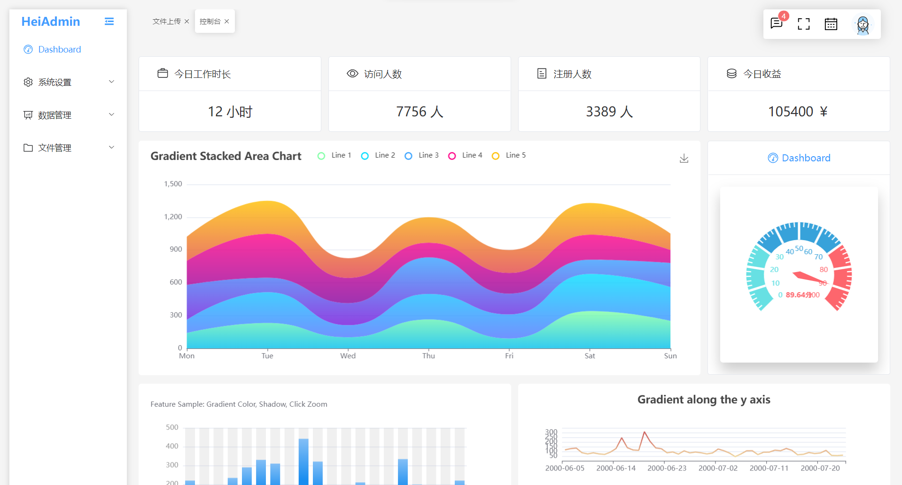

# HeiAdmin

### 项目介绍

基于 vue3、vite、element-plus、pinia、mock，搭建的一个的通用后台管理系统模板

### 项目界面




### 安装项目依赖

#### Node环境 

[node](https://nodejs.org/en/)版本 >=12.0.0

#### 包管理器 

推荐使用[pnpm](https://www.pnpm.cn/)

```
pnpm install
```

### 启动命令

```
pnpm run dev
```

`登录账号/密码` admin / 123456

### 多环境打包

- .env.development 开发环境

- .env.production  生产环境

```
pnpm run build:prod 
```

### 技术栈

| 技术         | 说明            | 版本   | 官网链接                                   |
| ------------ | --------------- | ------ | ------------------------------------------ |
| vue          | 前端框架        | 3.2.37 | https://staging-cn.vuejs.org/              |
| vue-router   | 路由管理        | 4.1.2  | https://router.vuejs.org/zh/index.html     |
| pinia        | 全局状态管理    | 2.0.16 | https://pinia.web3doc.top/                 |
| element-plus | 前端 UI 框架    | 2.2.9  | https://element-plus.gitee.io/zh-CN/       |
| vite         | 打包工具        | 3.0.0  | https://vitejs.cn/                         |
| axios        | 前端 http 库    | 0.27.2 | http://www.axios-js.com/                   |
| echarts      | 可视化图表库    | 5.3.3  | https://echarts.apache.org/zh/index.html   |
| mockjs       | 假数据生成工具  | 1.1.0  | http://mockjs.com/                         |
| nprogress    | 进度条控件      | 0.2.0  | https://ricostacruz.com/nprogress/         |
| screenfull   | 全屏显示控件    | 6.0.2  | https://github.com/sindresorhus/screenfull |
| js-cookie    | cookie 管理工具 | 3.0.1  | https://github.com/js-cookie/js-cookie     |
